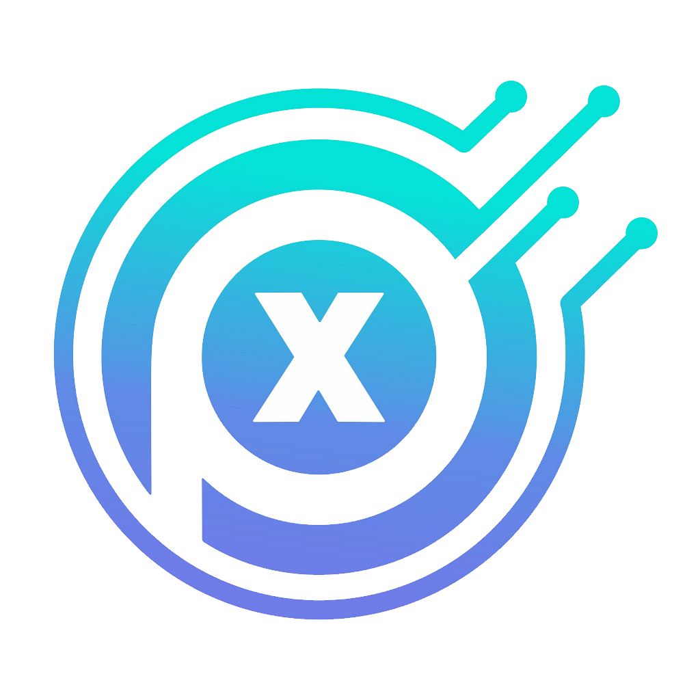

# PXView

[](https://www.gnu.org/licenses/gpl-3.0)
[](#)

PXView is a Qt-based signal analysis software for [PXLogic](https://marrychip.com) logic analyzers and a wide range of third-party instruments. It is built upon the [sigrok](https://sigrok.org) project and [DSView](https://www.dreamsourcelab.com), providing a comprehensive GUI for signal capture, protocol decoding, and automated testing.

[](https://marrychip.com)

## Key Features

- **Multi-mode signal acquisition** — Logic analyzer, oscilloscope (DSO), and mixed-signal oscilloscope (MSO) modes with simultaneous digital and analog channel display
- **220+ protocol decoders** — I²C, SPI, UART, CAN, PWM, USB, JTAG, I²S, Modbus, IR (NEC/RC5/RC6/SIRC), 1-Wire, SD card, and many more, with both Python and high-performance C implementations
- **187+ hardware drivers** — Native support for PXLogic devices plus broad compatibility with Saleae Logic, ChronoVu LA, ASIX Sigma, FTDI-based analyzers, Hantek DSO, Rigol DS, and many other instruments via libsigrok
- **MCP (Model Context Protocol) server** — Built-in HTTP API server (port 10110) enabling AI tools like Claude Code, Codex, and OpenCode to control devices, capture signals, and decode protocols through natural language
- **Headless mode** — Run `PXView --headless` for automated testing and CI/CD pipelines without a GUI, with full API access via MCP and WebSocket (port 10430)
- **USB hotplug** — Cross-platform hotplug support with automatic device detection and reconnection
- **Glitch filter** — Pulse analysis tool with histogram visualization, threshold adjustment, and undo support
- **Data export** — Export raw capture data and decoded results to CSV, binary, or session files (`.pxc`)
- **Cross-platform** — Linux (AppImage), macOS (Universal DMG for ARM64 + x86_64), and Windows

## PXLogic Hardware

PXView provides native support for PXLogic USB logic analyzers:

| Model | Channels | Max Sample Rate | Interface |
|-------|----------|-----------------|-----------|
| PX-Logic 32 | 32 ch | 1 GSa/s (buffer), 1 GSa/s (stream) | USB 3.0 / 2.0 |
| PX-Logic 16 Pro | 16 ch | 1 GSa/s (buffer), 1 GSa/s (stream) | USB 3.0 / 2.0 |
| PX-Logic 16 Plus | 16 ch | 500 MSa/s (buffer), 500 MSa/s (stream) | USB 3.0 / 2.0 |
| PX-Logic 16 Base | 16 ch | 250 MSa/s (buffer), 250 MSa/s (stream) | USB 3.0 / 2.0 |

## Device Support

PXView uses libsigrok as its hardware abstraction layer. All 89+ libsigrok hardware drivers are compiled in, and PXView scans every driver at startup via `sr_driver_list()` + `sr_driver_scan()`. However, the level of GUI support varies by device category.

### Tier 1 — Full GUI Support (Native)

These devices receive all PXView features: operation mode selection (Buffer/Stream), channel mode switching, device mode (Logic/Analog/DSO/MSO), hardware trigger configuration, DSO analog options (vdiv, coupling, offset, probe factor), firmware version checking, disk cache configuration, and stream buffer settings.

| Driver | Device | Connection | Notes |
|--------|--------|------------|-------|
| `pxlogic` | PXLogic PX-Logic 32/16 Pro/16 Plus/16 Base | USB 3.0/2.0 | Native, primary target hardware |
| `demo` | Virtual demo device | — | Built-in, no hardware required |

### Tier 2 — Compatible GUI Support (USB Auto-Detected)

These devices are automatically discovered via USB bus scan and appear in the PXView device dropdown. They support basic capture operations: channel enable/disable, sample rate selection, sample limit configuration, and stream mode auto-detection. They **do not** support: operation mode switching, hardware trigger, DSO-specific analog options, channel mode configuration, or firmware management.

#### Logic Analyzers

| Driver | Device | Firmware Required |
|--------|--------|-------------------|
| `dreamsourcelab-dslogic` | DreamSourceLab DSLogic / DSCope series | Yes (DSLogic.fw, DSCope.fw) |
| `fx2lafw` | Cypress FX2LP-based LAs (Saleae Logic, FX2 eval boards, etc.) | Yes (fx2lafw-*.fw) |
| `ftdi-la` | FTDI-based logic analyzers | No |
| `asix-sigma` | ASIX SIGMA / SIGMA2 | Yes (asix-sigma-*.fwb) |
| `chronovu-la` | ChronoVu LA8 / LA16 | No |
| `hantek-4032l` | Hantek 4032L | No |
| `ikalogic-scanalogic2` | IKALOGIC Scanalogic2 | No |
| `ikalogic-scanaplus` | IKALOGIC ScanAPLUS | No |
| `kingst-la2016` | Kingst LA2016 | Yes (MCU firmware + FPGA) |
| `lecroy-logicstudio` | LeCroy LogicStudio | Yes (FPGA + FX2) |
| `openbench-logic-sniffer` | Openbench Logic Sniffer (OLS) / JTAGulator | No (persistent) |
| `pipistrello-ols` | Pipistrello OLS | No |
| `saleae-logic-pro` | Saleae Logic Pro 16 | Yes (FX3 + FPGA) |
| `saleae-logic16` | Saleae Logic16 | Yes (FX2 + FPGA) |
| `sipeed-slogic-analyzer` | Sipeed SLogic / SLogic16U3 | No |
| `sysclk-lwla` | Sysclk LWLA1034 / LWLA1016 | Yes (bitstream) |
| `sysclk-sla5032` | Sysclk SLA5032 | Yes (FPGA) |
| `zeroplus-logic-cube` | Zeroplus Logic Cube | No |
| `greatfet` | GreatFET | No |
| `raspberrypi-pico` | Raspberry Pi Pico (as LA) | Yes (pico firmware) |

#### Oscilloscopes

| Driver | Device | Firmware Required |
|--------|--------|-------------------|
| `hantek-6xxx` | Hantek 6022BE / 6022BL / SainSmart DDS120 / Rocktech BM102 | Yes (fx2lafw) |
| `hantek-dso` | Hantek DSO-2090 and similar | Yes (vendor firmware) |
| `rigol-ds` | Rigol DS series | No |
| `siglent-sds` | Siglent SDS series | No |
| `lecroy-xstream` | LeCroy XStream series | No |
| `hameg-hmo` | Hameg HMO series | No |
| `gwinstek-gds-800` | GW Instek GDS-800 | No |
| `yokogawa-dlm` | Yokogawa DLM series | No |
| `hung-chang-dso-2100` | Hung-Chang DSO-2100 | No |
| `link-mso19` | Link MSO-19 | No |

#### Other USB Devices

| Driver | Device | Firmware Required |
|--------|--------|-------------------|
| `lascar-el-usb` | Lascar EL-USB data loggers | No |

### Tier 3 — No GUI Support (Serial / SCPI / Bluetooth)

These drivers require a `conn=` parameter (serial port, TCP/VXI address, or Bluetooth MAC) to scan for devices. PXView's GUI does not provide a connection specification dialog, so these devices **cannot be used from the PXView GUI**. They are compiled into libsigrok and may be accessible via the MCP API or sigrok-cli with explicit connection parameters.

#### Multimeters (DMM)

| Driver | Device | Connection |
|--------|--------|------------|
| `agilent-dmm` | Agilent DMM (SCPI) | TCP/VXI/USB-TMC |
| `appa-55ii` | APPA 55II | Bluetooth BLE |
| `fluke-45` | Fluke 45 | Serial RS232 |
| `fluke-dmm` | Fluke 18x/190/28x series | Serial / USB |
| `gmc-mh-1x-2x` | Gossen Metrawatt Metrahit 1x/2x | Serial / HID |
| `norma-dmm` | Norma DMM | SCPI |
| `serial-dmm` | Generic serial DMM (various sub-drivers) | Serial |
| `scpi-dmm` | Generic SCPI DMM | TCP/VXI/USB-TMC |
| `uni-t-dmm` | UNI-T DMM (UT61x, UT71x, etc.) | USB HID (requires VID:PID) |
| `uni-t-ut181a` | UNI-T UT181A | Serial USB |
| `mooshimeter-dmm` | Mooshimeter | Bluetooth BLE |
| `mastech-ms6514` | MASTECH MS6514 | Serial USB |
| `bkprecision-1856d` | BK Precision 1856D | Serial USB |

#### Power Supplies (PSU)

| Driver | Device | Connection |
|--------|--------|------------|
| `atten-pps3xxx` | Atten PPS3xxx | Serial USB |
| `gwinstek-gpd` | GW Instek GPD | Serial USB |
| `gwinstek-psp` | GW Instek PSP | Serial USB |
| `korad-kaxxxxp` | Korad KAXXXXP | Serial USB |
| `manson-hcs-3xxx` | Manson HCS-3xxx | Serial USB |
| `motech-lps-30x` | Motech LPS-30x | Serial USB |
| `rdtech-dps` | RDTech DPS | Serial USB (Modbus) |
| `rdtech-um` | RDTech UM | Serial USB (Modbus) |
| `scpi-pps` | Generic SCPI PSU | TCP/VXI/USB-TMC |
| `rigol-dg` | Rigol DG (function generator) | SCPI |
| `itech-it8500` | iTech IT8500 | Serial USB |
| `juntek-jds6600` | Juntek JDS6600 | Serial USB |
| `rohde-schwarz-sme-0x` | Rohde & Schwarz SME-0x | SCPI |

#### LCR Meters / Scales

| Driver | Device | Connection |
|--------|--------|------------|
| `serial-lcr` | Serial LCR meters | Serial |
| `kern-scale` | Kern scale | Serial USB |

#### Sound Level Meters

| Driver | Device | Connection |
|--------|--------|------------|
| `colead-slm` | Colead SLM | Serial USB |
| `cem-dt-885x` | CEM DT-885x | Serial USB |
| `pce-322a` | PCE-322A | Serial USB |
| `testo` | Testo 435/480/6681 | Serial USB |

#### Other Instruments

| Driver | Device | Connection |
|--------|--------|------------|
| `arachnid-labs-re-load-pro` | Arachnid Labs Re:load Pro | Serial USB |
| `atorch` | Atorch (power monitor) | Serial USB |
| `baylibre-acme` | BayLibre ACME (GPIO/I2C) | Platform I2C |
| `beaglelogic` | BeagleLogic | Platform (BeagleBone) |
| `center-3xx` | Center 3xx thermometer | Serial |
| `conrad-digi-35-cpu` | Conrad Digi 35 CPU | Serial |
| `dcttech-usbrelay` | DCTTech USB Relay | Serial USB |
| `devantech-eth008` | Devantech ETH008 Relay | TCP |
| `hp-3457a` | HP 3457A | GPIB/Serial |
| `hp-3478a` | HP 3478A | GPIB/Serial |
| `hp-59306a` | HP 59306A | GPIB/Serial |
| `icstation-usbrelay` | ICStation USB Relay | Serial USB |
| `ipdbg-la` | IPDBG Logic Analyzer | TCP |
| `kecheng-kc-330b` | Kecheng KC-330B | Serial USB |
| `maynuo-m97` | Maynuo M97 | Serial USB |
| `mic-985xx` | MIC 985xx (temp/humidity) | Serial USB |
| `microchip-pickit2` | Microchip PICkit2 | USB (serial mode) |
| `rdtech-tc` | RDTech TC | Serial USB (Modbus) |
| `siglent-sdl10x0` | Siglent SDL10x0 (DC load) | SCPI |
| `teleinfo` | Teleinfo (EDF energy meter) | Serial |
| `tondaj-sl-814` | Tondaj SL-814 (sound level) | Serial |
| `uni-t-ut32x` | UNI-T UT32x (thermometer) | Serial USB |
| `zketech-ebd-usb` | ZKETech EBD USB (DC load) | Serial USB |
| `asix-omega-rtm-cli` | ASIX OMEGA (RTM CLI mode) | External process |

### Summary

| Tier | GUI Support | Driver Count | Description |
|------|-------------|--------------|-------------|
| Tier 1 | Full | 2 (`pxlogic`, `demo`) | All features: operation mode, trigger, DSO options, firmware |
| Tier 2 | Compatible (basic) | ~31 USB drivers | Auto-detected; basic capture only, no advanced features |
| Tier 3 | None (no GUI) | ~56 serial/SCPI/BT drivers | Compiled in but not accessible from GUI; requires conn= parameter |

**Total:** 89+ hardware drivers compiled into libsigrok, with 33 accessible via the PXView GUI (2 full + 31 basic) and 56+ requiring serial/SCPI/Bluetooth connection parameters not exposed by the GUI.

## Installation

See the detailed build and installation guides:

- [INSTALL.md](INSTALL.md) — English
- [INSTALL_zh.md](INSTALL_zh.md) — 中文

Pre-built packages are available for download from the [releases page](https://github.com/PXLogic/PXView/releases).

## Source Code (Git Submodules)

PXView references the sigrok project's official upstream repositories via git submodules, ensuring complete open-source repository paths and git history are included in source distribution. Clone with `--recursive`:

```bash
git clone --recursive <PXView-repo-url> PXView
cd PXView
```

If already cloned without submodules, initialize them manually:

```bash
git submodule update --init --recursive
```

Included submodules (located at the repository root, alongside `libsigrok/`):

| Submodule | Upstream Repository | Purpose |
|-----------|-------------------|---------|
| `libsigrok/` | `https://github.com/sigrokproject/libsigrok` (pxview-fork branch) | Upstream libsigrok 0.6.0 (187+ drivers) + PXLogic/sipeed-slogic drivers + sr_compat layer + CMake build |
| `libsigrokdecode/` | `https://github.com/sigrokproject/libsigrokdecode` (pxview-fork branch) | Upstream libsigrokdecode + C decoder subsystem (215+ C decoders + API framework, API v4) |
| `sigrok-firmware/` | `git://sigrok.org/sigrok-firmware` | Redistributable firmware for ASIX Sigma + Sysclk LWLA (vendor-licensed) |
| `sigrok-firmware-fx2lafw/` | `git://sigrok.org/sigrok-firmware-fx2lafw` | Open-source Cypress FX2 firmware source (GPLv2+, requires sdcc to compile) |
| `sigrok-util/` | `git://sigrok.org/sigrok-util` | Vendor firmware extraction scripts (`firmware/` subdirectory) |

### Building fx2lafw Firmware

The `sigrok-firmware-fx2lafw/` submodule contains source code but no pre-compiled `.fw` files. Build them on-site using the sdcc compiler:

```bash
# Install sdcc (example: Ubuntu)
sudo apt install sdcc

# From the repository root
bash build_fx2lafw.sh
```

This produces 15 `fx2lafw-*.fw` files under `sigrok-firmware-fx2lafw/hw/*/`. The `ninja install` step automatically detects and packages them into `share/sigrok-firmware/`.

If fx2lafw is not built, CMake will emit a WARNING and only the 8 ASIX Sigma + Sysclk LWLA firmware files will be packaged (FX2-based devices will not be recognized).

## MCP API and AI Integration

PXView includes a built-in MCP server that allows AI programming tools to control hardware devices through a standardized protocol. The server starts automatically on port 10110.

### Connecting AI Tools

```bash
# Claude Code
claude mcp add --transport http pxview http://127.0.0.1:10110

# Codex
codex mcp add --url http://127.0.0.1:10110 pxview

# OpenCode
opencode --mcp http://127.0.0.1:10110
```

### Available MCP Tools

| Category | Tools |
|----------|-------|
| Device management | `get_devices`, `get_channels` |
| Capture control | `start_capture`, `stop_capture`, `wait_capture`, `get_capture_status` |
| Protocol decoding | `list_analyzers`, `get_analyzer_options`, `add_analyzer`, `remove_analyzer`, `get_analyzer_results` |
| Data export | `export_raw_data_csv`, `export_raw_data_binary`, `export_data_table_csv` |
| File operations | `load_capture`, `save_capture`, `close_capture` |

See the [MCP usage guide](doc/MCP与Web客户端使用指南.md) for detailed documentation.

## Useful Links

- [PXLogic](https://marrychip.com) — Official website
- [sigrok.org](https://sigrok.org) — Upstream sigrok project
- [DreamSourceLab](https://www.dreamsourcelab.com) — DSView project

## Status

PXView is in a usable state with official releases. However, it is still a work in progress — some basic functionality is available and working, while other features remain on the TODO list.

## Copyright and License

PXView is licensed under the terms of the GNU General Public License (GPL), version 3 or later.

While some individual source code files are licensed under the GPLv2+, and some files are licensed under the GPLv3+, this doesn't change the fact that the program as a whole is licensed under the terms of the GPLv3+ (e.g. also due to the fact that it links against GPLv3+ libraries).

Please see the individual source files for the full list of copyright holders.
